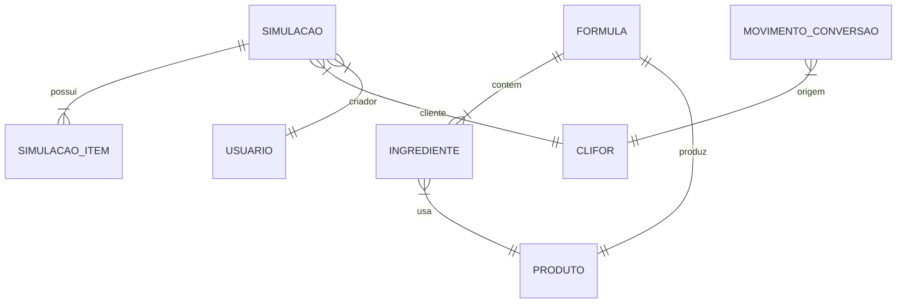

# Modelo de Dados (Entidades)

Esta seção descreve as principais entidades do domínio do MedidaPro, úteis para desenvolvedores ou administradores que precisam entender a estrutura do banco de dados.

## Principais Entidades

### Formula (`FormulasMedidaPro`)
Define a receita de um produto.
*   `IdFormula`: Identificador único.
*   `Nome`: Nome descritivo.
*   `ProdutoFinal`: O produto resultante.
*   `PercentualDesperdicio`: Perda estimada.
*   `Ingredientes`: Lista de `Ingrediente`.

### Ingrediente
Componente de uma fórmula.
*   Vincula um `Produto` (insumo) a uma `Formula`.
*   Define a quantidade necessária.

### Simulacao (`SimulacoesMedidaPro`)
Registro de um cálculo de custos/preços em um determinado momento.
*   `Usuario`: Quem criou.
*   `DataSimulacao`: Quando foi criada.
*   `CliFor`: Cliente associado.
*   `Itens`: Lista de produtos simulados (`SimulacaoItem`).
*   `IncluirMaoDeObra`: Flag de configuração.

### MovimentoConversao (`BuscaMovimentosConversao`)
Entidade de leitura (View) que agrega dados de notas fiscais para produção.
*   Mapeada como imutável (`@Immutable`).
*   Utilizada para disparar as procedures de produção.

### Orcamento
Representa uma proposta comercial.
*   Pode ser gerado a partir de uma simulação.

### Produto e CliFor
Entidades básicas de cadastro.
*   `Produto`: Itens que podem ser insumos ou produtos finais.
*   `CliFor`: Cadastro único de Clientes e Fornecedores.

## Diagrama Relacional Simplificado

